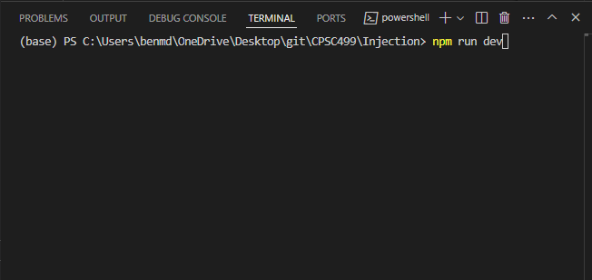
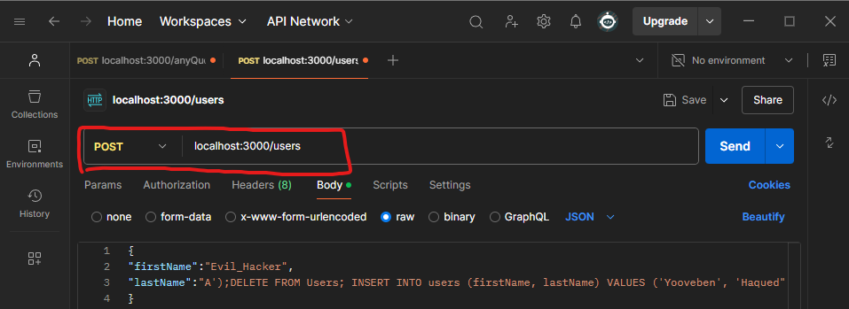
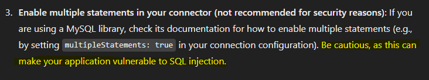
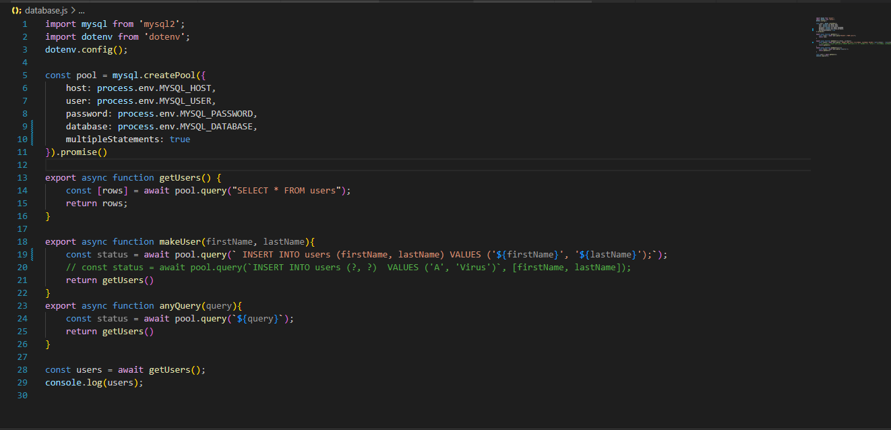
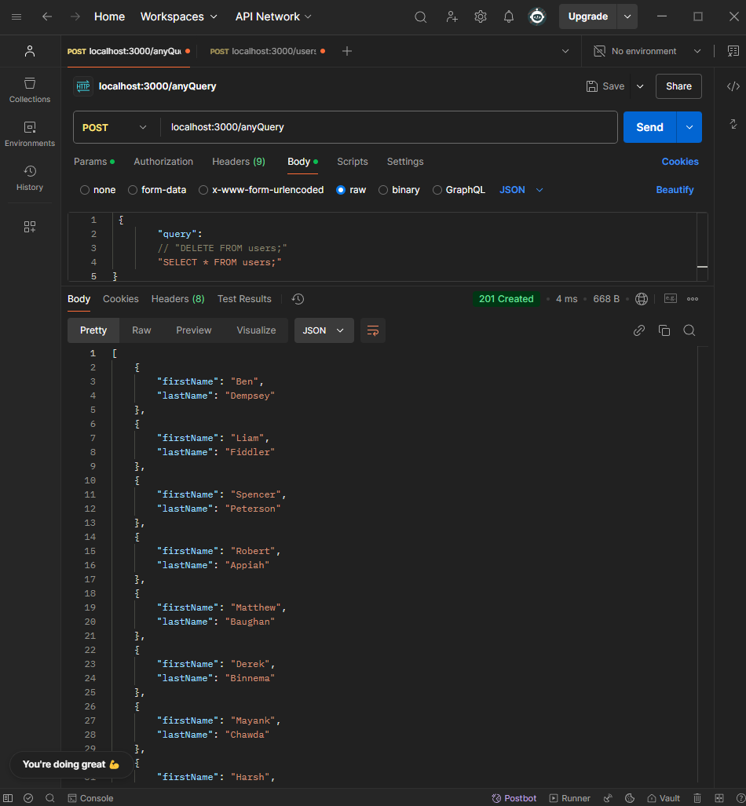
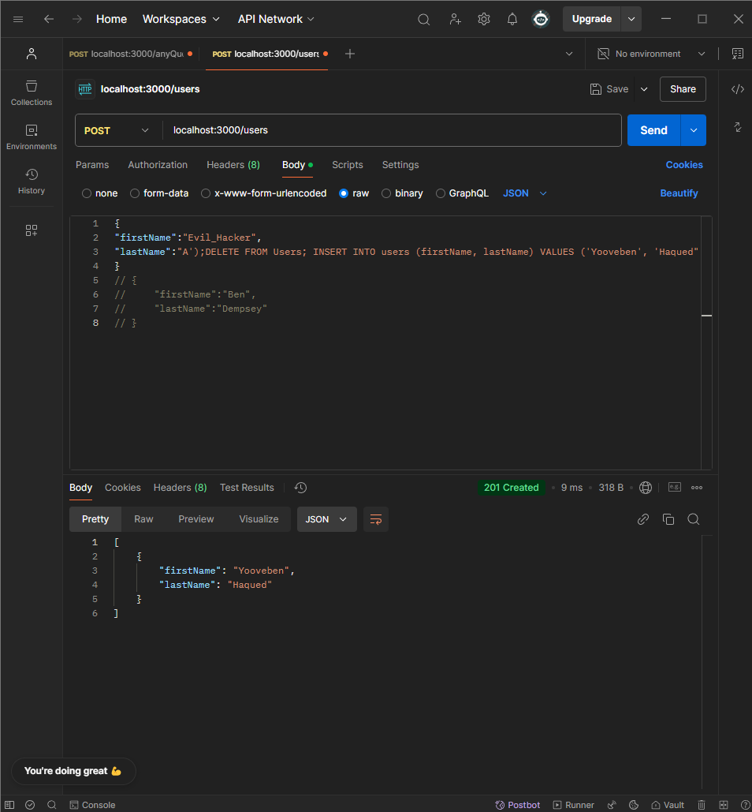

# SQL Injection API
This APIs has been intentionally designed to be vulnerable to SQL Injections for research purposes as part of a project for CPSC499 Risk Management.

## To use:
1. `>>npm run dev` in terminal in the 'Injection' directory

2. Open Postman and enter the following under `POST`:

3. The intention of this query is to create a user by supplying a firstName and lastName, however it is very vulnerable to attacks. Can you figure out how?

## How it is vulnerable:
1. Unsanitized input: The `makeUser()` function on line 18 runs the posted query directly with no checks or balances. Line 20 features the safer code in a comment (however the goal of this API is to be vulnerable, so we commented it out). The two question marks are left blank in the query, and the user inputted values are sent seperately to the query and mySQL runs its own checks to validate the input and insure they are legitimate values and not queries themselves.
2. multipleStatements allowed: On line 10 we included `multipleStatements: true` which explicitly warns developers of the dangers of SQL Injections. This allows one single line of SQL code to end, and begin a new statement within the same query. Clearly, this is a security risk. 
Here is ChatGPT's input on the matter:

## Executing an Attack:
To excecute a SQL injection attack on this database a hacker must understand the query. The `makeUser()` query is excecuted through this line: `const status = await pool.query(' INSERT INTO users (firstName, lastName) VALUES ('${firstName}', '${lastName}');');`. A keen eye might notice that we could input something malicious into either argument to end the `INSERT` statement and begin a new SQL statement. Here is an example query body that would delete the entire `users` table: 
`{` 
`"firstName":"Evil_Hacker",` 
`"lastName":"A');DELETE FROM Users; INSERT INTO users (firstName, lastName) VALUES ('Yooveben', 'Haqued"` 
`}` 
The last insert is needed to match the syntax of the original query. Otherwise it throws a syntax error.
# Example:

Result is a users table with only the malicious insert result.